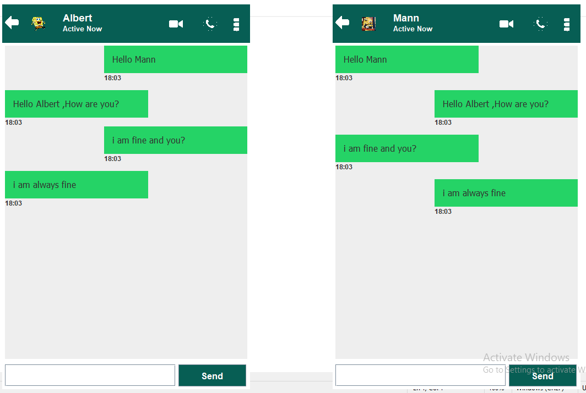

# Simple Java WhatsApp Chatting Application

This is a simple chat application implemented in Java, consisting of both server-side and client-side components. The application allows multiple clients to connect to a central server and exchange messages in real-time.

## Features

- **Server-side Implementation**: Provides a server program (`Server.java`) that listens for client connections and broadcasts messages to all connected clients.
- **Client-side Implementation**: Provides a client program (`Client.java`) with a graphical user interface (GUI) for sending and receiving messages from the server.
- **GUI Components**: The client GUI includes text input fields, message display panels, and buttons for sending messages.
- **Real-time Communication**: Clients can send messages to the server, which are then broadcasted to all other connected clients in real-time.

## Usage

1. **Clone Repository**: Clone this repository to your local machine using the following command:

    ```
    git clone https://github.com/mannbhatt/Chating-App.git
    ```

2. **Compile and Run Server**: Compile and run the `Server.java` file to start the chat server. The server and client are intended to run on the same machine:

    ```
    javac Server.java
    java Server.java
    ```

3. **Compile and Run Client**: Compile and run the `Client.java` file to start the chat client:

    ```
    javac Client.java
    java Client.java
    ```

4. **Use the Chat Application**: Once the server and client are running, you can start sending and receiving messages using the client GUI.

## Requirements

- Java Development Kit (JDK) installed on your system.
- Basic knowledge of Java programming and socket communication.

## Contributing

Contributions are welcome! If you have any suggestions, bug reports, or feature requests, please open an issue or submit a pull request.

## License

This project is licensed under the [MIT License](LICENSE).
